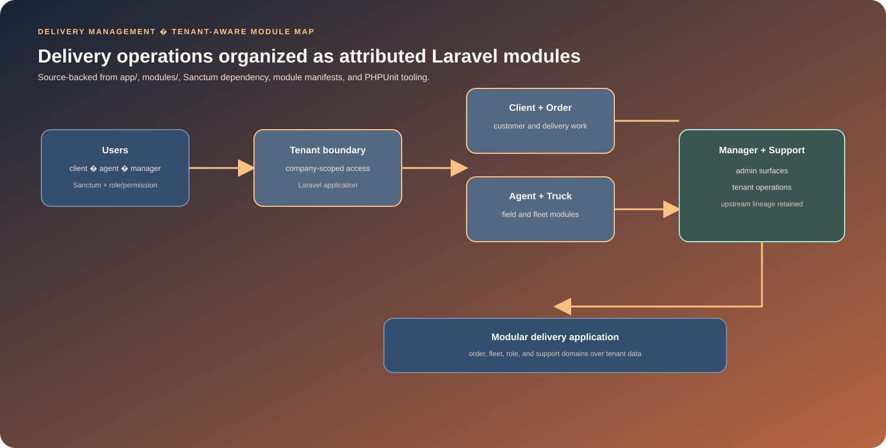
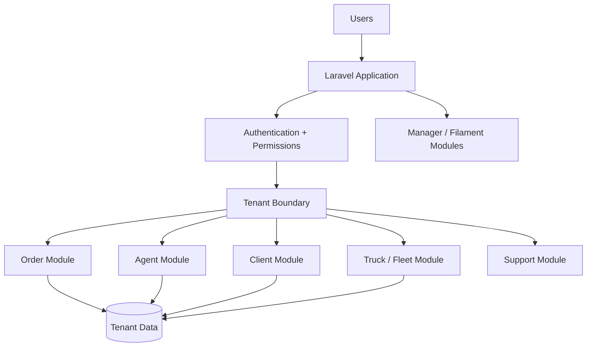

# Delivery Management Reference Application

**A modular multi-tenant Laravel application for delivery-company administration, customer accounts, orders, agents and fleet operations.**

## Product architecture and engineering highlights

<p align="center">
  
</p>

A multi-tenant delivery-operations application covering customers, delivery agents, orders, permissions, support, and fleet-oriented administration.

- **Architecture:** A Laravel modular monolith separates Agent, Client, Manager, Order, Tenant, Truck, Support, User, and related domains, with Sanctum authentication and role/permission infrastructure.
- **Distinctive engineering:** The system illustrates tenant-aware business workflows and role-specific operational surfaces; the source retains its upstream Mohaphez lineage.

## Overview

This repository implements a conventional SaaS-style delivery-management system using Laravel modules. Its value is primarily as a reference for full-stack and backend architecture: tenant isolation, modular domain boundaries, role/permission infrastructure, order operations, administrative interfaces and container-oriented deployment.

The codebase is **not presented as an original greenfield implementation by Jason Lee**. It retains clear upstream Mohaphez authorship and project lineage in source metadata. That provenance materially affects its value as personal engineering evidence and should be considered before keeping it public for job applications.

## Verified Capabilities

- Laravel 10 application architecture.
- Modular domains for Agent, Client, Core, Manager, Order, Permission, Support, Tenant, Theme, Truck and User concerns.
- Authentication middleware and Laravel Sanctum dependency.
- Multi-tenant application structure.
- Order-management domain module.
- Agent/client/manager application separation.
- Fleet/truck domain module.
- Role and permission infrastructure.
- Theme/module composition.
- PHPUnit test tooling.
- Docker/Sail-oriented development setup.
- Composer module merging through `nwidart/laravel-modules` and the repository's module manifests.

## Architecture



## Example Workflow

1. A user authenticates into the appropriate tenant/application surface.
2. Tenant context determines the isolated company scope.
3. A client or agent creates/manages an order through the order domain.
4. Role/permission rules control access to operational actions.
5. Fleet and user modules provide related operational entities.
6. Manager/admin surfaces expose system and tenant administration.

## Tech Stack

| Area | Technology |
|---|---|
| Language | PHP 8.2, JavaScript |
| Backend | Laravel 10 |
| Frontend | Laravel/Vite; modular theme assets |
| Authentication | Laravel Sanctum |
| Architecture | `nwidart/laravel-modules` |
| Data | Laravel database layer |
| Testing | PHPUnit 10 |
| Infrastructure | Laravel Sail/Docker |

## Code map and evidence

| Concern | Location | What is actually present |
|---|---|---|
| Module composition | `modules_statuses.json`, `config/modules.php`, `modules/*/module.json` | Agent, Client, Manager, Order, Permission, Tenant, Truck, User and supporting modules are enabled in the snapshot |
| Tenant and delivery domains | `modules/Tenant/`, `modules/Order/`, `modules/Agent/`, `modules/Truck/` | tenant/domain entities, migrations, repositories, services and Filament resources |
| Role-specific surfaces | `modules/*/Filament/Agent/` and `modules/*/Filament/Manager/` | separate operational/admin resource areas |
| API example | `modules/User/Routes/API/V1/` and `modules/User/Http/` | versioned profile routes, requests and resources |
| Automated checks | `modules/User/Tests/Feature/API/V1/Profile/ProfileControllerTest.php` plus PHPUnit tooling | one module feature test is present; a root `tests/` suite and deployment workflow are not present in this snapshot |

## Engineering Notes

### Modular domain separation
The repository separates operational areas into Laravel modules instead of concentrating delivery logic in the application root. This is useful for studying boundaries between tenant, order, agent, fleet and administration concerns.

### Multi-tenant SaaS structure
Tenant isolation is a first-class architectural concern, allowing multiple delivery businesses to operate through the same application structure while keeping company context separated.

### Local infrastructure
The repository includes Docker Compose/Sail-oriented local infrastructure. Deployment automation is not part of the current repository snapshot.

## Getting Started

The existing project is configured around Laravel Sail. At a high level:

```bash
composer install
cp .env.example .env
./vendor/bin/sail up -d
./vendor/bin/sail artisan key:generate
./vendor/bin/sail artisan module:migrate
```

The tracked frontend is the Mars theme. With Node.js/npm installed, build its Vite assets from the repository root:

```bash
npm run production
```

Additional module seeding, permission generation and frontend setup are required by the upstream application configuration. Inspect the module and environment configuration before running it; do not use example credentials in a public deployment.

## Repository Structure

```text
app/                 Laravel application shell
modules/             Domain modules
  Agent/
  Client/
  Manager/
  Order/
  Permission/
  Tenant/
  Truck/
  User/
themes/              Theme packages
database/            Application database setup
.env.example         Example application configuration
```

## Status

**Archive / replacement candidate for personal job-application use.** The software itself is a substantial full-stack Laravel codebase, but retained upstream attribution throughout the repository means it is weak evidence of Jason Lee's original engineering unless there is a clearly documented, substantial set of personal modifications that can be isolated and demonstrated.

## Provenance

The previous README, clone instructions, screenshots and module metadata identify the upstream project/author as `mohaphez/delivery-platform` / Mohaphez. That provenance should remain visible. A README rewrite alone does not make upstream code original work.

## License

The root Composer metadata declares MIT. Verify the upstream repository's complete license and attribution requirements before redistribution or modification of licensing material.

---

**Repository owner:** [@Masterleeaus](https://github.com/Masterleeaus)
