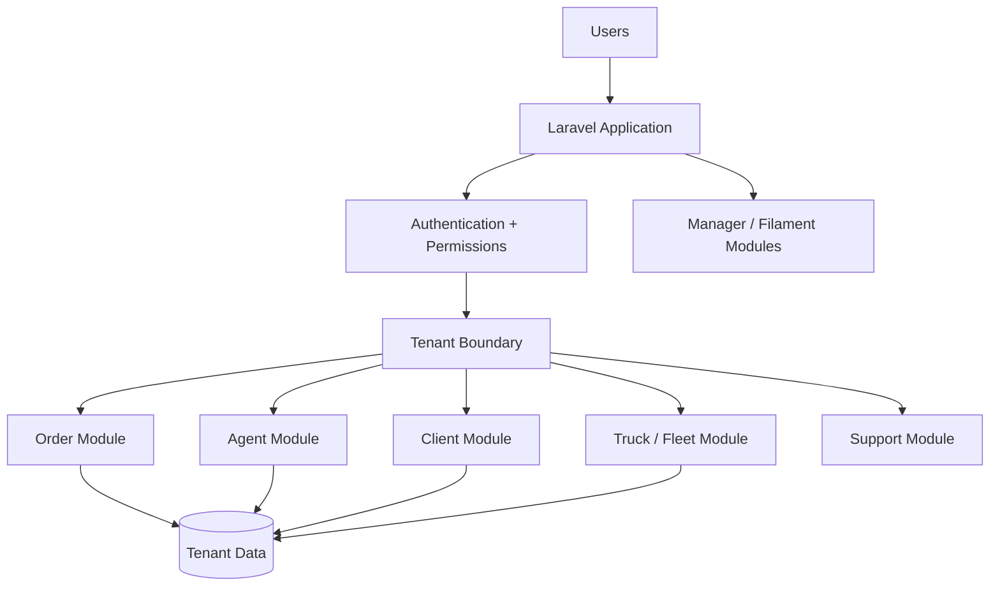

# Delivery Management Platform

> A modular multi-tenant Laravel application for delivery-company administration, customer accounts, orders, agents, and fleet operations.

## Overview

Delivery Management Platform provides a reference architecture for delivery businesses that need tenant-aware operations rather than a single undifferentiated admin panel. Its modular monolith separates delivery domains, role-specific surfaces, authentication, and fleet concerns so teams can study how the pieces fit together in one Laravel application.


## Measured evidence

The strongest focused verification is around the tenant boundary and the maintained profile API.

| Focused evidence | Cases present | What it verifies |
| --- | ---: | --- |
| Root tenant-boundary feature file | **3 Pest cases** | central-domain rejection, authenticated-user non-bypass, and unmapped-domain failure before the tenant route handler |
| Maintained profile API feature file | **4 Pest cases** | unauthenticated rejection, own-profile retrieval, validation failure and persisted profile update |
| Focused cases across those two files | **7** | tenancy + authenticated API behavior |

The pull-request workflow also performs:

```text
composer validate
composer install
SQLite test configuration
module:migrate
module:seed
php artisan test
maintained profile-module test
```

A separate synthetic failure-path job verifies that a failed verification result cannot satisfy the deployment workflow condition.

These are repository verification mechanisms; they do **not** establish a production deployment or claim original authorship of the upstream delivery platform.

## What is new

For portfolio purposes, the technically interesting mechanism is **domain-based tenant isolation spanning database lifecycle, cache, filesystem and queue context**, combined with concrete delivery/order/fleet modules.

```text
Authenticated user
      ↓
Domain → tenant resolution
      ↓
Tenant database/context
      ├── cache scope
      ├── filesystem scope
      └── queue scope
      ↓
Order / agent / fleet domain
      ↓
Role-specific surface
```

The repository is therefore most useful as an attributed reference architecture for multi-tenant Laravel operations, not as a novel AI system.

<p align="center">
  
</p>

## Verified capabilities

| Capability | Implementation evidence |
|---|---|
| Modular delivery domains | `modules_statuses.json`, `config/modules.php`, and `modules/*/module.json` define enabled Agent, Client, Manager, Order, Tenant, Truck, User, and supporting modules. |
| Customer orders and delivery details | `modules/Order/` contains customer-order workflows including delivery date/location and related domain persistence. |
| Fleet assignment and delivery costs | `modules/Truck/` contains fleet workflows for truck assignment and fuel volume/pricing data. |
| Domain-based tenant isolation | `modules/Tenant/`, `TenantServiceProvider`, and the `Tenant` model create/migrate separate tenant databases and scope cache, filesystem, and queue context. |
| Role-specific workflows | `modules/*/Filament/Agent/`, `modules/*/Filament/Manager/`, and `AgentPanelProvider` provide separate operational and administration surfaces. |
| API and infrastructure | `modules/User/Routes/API/V1/`, PHPUnit tooling, and Laravel Sail/Docker assets provide a concrete API/module/runtime reference. |

The differentiator is domain-based tenancy: tenant database lifecycle and scoped cache, filesystem, and queue context sit alongside concrete customer-order and fleet workflows in the same modular application.

**Provenance:** this repository retains the Mohaphez / `mohaphez/delivery-platform` lineage and attribution.

## Capability inventory

- Laravel 10 application architecture.
- Modular domains for Agent, Client, Core, Manager, Order, Permission, Support, Tenant, Theme, Truck and User concerns.
- Authentication middleware and Laravel Sanctum dependency.
- Multi-tenant application structure.
- Domain-based tenant database creation/migration with cache, filesystem and queue scoping.
- Order-management domain module.
- Customer orders with delivery date and location data.
- Truck assignment with fuel volume and pricing data.
- Agent/client/manager application separation.
- Fleet/truck domain module.
- Role and permission infrastructure.
- Theme/module composition.
- PHPUnit test tooling.
- Docker/Sail-oriented development setup.
- Composer module merging through `nwidart/laravel-modules` and the repository's module manifests.

## Architecture



## Example workflow

1. A user authenticates into the appropriate tenant/application surface.
2. Tenant context determines the isolated company scope.
3. A client or agent creates/manages a customer order with delivery date and location through the order domain.
4. Role/permission rules control access to operational actions.
5. Truck/fleet workflows assign vehicles and track fuel volume and pricing alongside user operations.
6. Manager/admin surfaces expose system and tenant administration.

## Technology

| Area | Technology |
|---|---|
| Language | PHP 8.2, JavaScript |
| Backend | Laravel 10 |
| Frontend | Laravel/Vite; modular theme assets |
| Authentication | Laravel Sanctum |
| Architecture | `nwidart/laravel-modules` |
| Data | Laravel database layer |
| Testing | PHPUnit 10 |
| Infrastructure | Laravel Sail/Docker |

## Code map and evidence

| Concern | Location | What is actually present |
|---|---|---|
| Module composition | `modules_statuses.json`, `config/modules.php`, `modules/*/module.json` | Agent, Client, Manager, Order, Permission, Tenant, Truck, User and supporting modules are enabled in the snapshot |
| Tenant and delivery domains | `modules/Tenant/`, `modules/Order/`, `modules/Agent/`, `modules/Truck/` | tenant/domain entities, migrations, repositories, services and Filament resources, including customer orders, delivery date/location, truck assignment and fuel data |
| Role-specific surfaces | `modules/*/Filament/Agent/`, `modules/*/Filament/Manager/`, `AgentPanelProvider` | separate agent/manager operational and administration resource areas |
| API example | `modules/User/Routes/API/V1/` and `modules/User/Http/` | versioned profile routes, requests and resources |
| Automated checks | `tests/Feature/TenantBoundaryTest.php`, `modules/User/Tests/Feature/API/V1/Profile/ProfileControllerTest.php`, and PHPUnit tooling | root tenant-boundary checks and the maintained profile module test are exercised by `.github/workflows/verify.yml` and the verification stage of `.github/workflows/.deploy.yml` using SQLite setup; image build/push remains separately gated |

## Engineering Notes

### Modular domain separation
The repository separates operational areas into Laravel modules instead of concentrating delivery logic in the application root. This is useful for studying boundaries between tenant, order, agent, fleet and administration concerns.

### Domain-based tenant isolation
The tenant domain creates and migrates separate tenant databases and keeps runtime context scoped across cache, filesystem and queue operations. `TenantServiceProvider` and the `Tenant` model provide the tenant lifecycle boundary, while `AgentPanelProvider` supports the agent-facing panel.

### Local infrastructure
The repository includes Docker Compose/Sail-oriented local infrastructure. Deployment automation is defined in `.github/workflows/.deploy.yml`, while `.github/workflows/verify.yml` runs the pull-request verifier. The stage image build/push path is guarded by successful verification and a merged pull request targeting `dev`; this documents the workflow contract, not production readiness.

## Installation and quick start

The existing project is configured around Laravel Sail. At a high level:

```bash
composer install
cp .env.example .env
./vendor/bin/sail up -d
./vendor/bin/sail artisan key:generate
./vendor/bin/sail artisan module:migrate
```

The tracked frontend is the Mars theme. With Node.js/npm installed, build its Vite assets from the repository root:

```bash
npm run production
```

Additional module seeding, permission generation and frontend setup are required by the upstream application configuration. Inspect the module and environment configuration before running it; do not use example credentials in a public deployment.

## Repository structure

```text
app/                 Laravel application shell
modules/             Domain modules
  Agent/
  Client/
  Manager/
  Order/
  Permission/
  Tenant/
  Truck/
  User/
themes/              Theme packages
database/            Application database setup
.env.example         Example application configuration
```

## Status

**Attributed reference application.** This is a substantial modular Laravel codebase for studying tenant-aware delivery operations, customer orders, fleet workflows and role-specific panels.

## Provenance

The repository retains the upstream `mohaphez/delivery-platform` / Mohaphez lineage and attribution. Preserve that provenance when extending or redistributing the reference application.

## License

The root Composer metadata declares MIT. Verify the upstream repository's complete license and attribution requirements before redistribution or modification of licensing material.

---

**Repository owner:** [@Masterleeaus](https://github.com/Masterleeaus)
